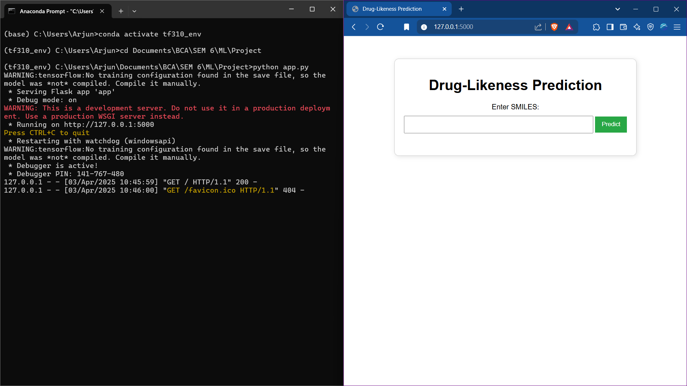
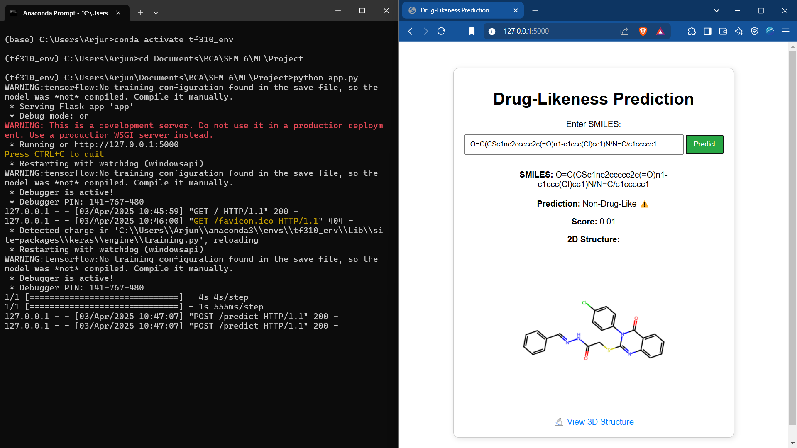

---

## 🧪 Drug-Likeness Prediction Using Deep Learning

This project is a **deep learning-based web application** that predicts the **drug-likeness** of a compound from its **SMILES (Simplified Molecular Input Line Entry System)** representation. It combines a predictive model with a user-friendly web interface and includes **2D and 3D molecular structure visualization**.

---

### 🔍 Features

- ✅ Accepts SMILES input from users  
- 🧠 Predicts if the compound is *drug-like* or *non-drug-like*  
- 📈 Uses a deep learning model combining CNN + LSTM + Bidirectional RNN layers  
- 🔬 Visualizes the molecular structure in:
  - **2D** (using RDKit)
  - **3D** (using Py3Dmol via MOLBlock conversion)
- 🌐 Flask-based web interface for interaction

---

### 🚀 Tech Stack

| Component        | Technology            |
|------------------|------------------------|
| Model            | TensorFlow (CNN + LSTM) |
| Data Parsing     | RDKit                  |
| Web Framework    | Flask                  |
| Visualization    | Py3Dmol (3D), RDKit (2D) |
| Frontend         | HTML, CSS, JS          |
| Deployment       | Localhost (Flask dev server) |
| Dataset          | 250k random ZINC molecules |

---

### 🏗️ Model Architecture

```python
model = Sequential([
    Conv1D(64, kernel_size=3, activation='relu', input_shape=(71, 89)),
    MaxPooling1D(pool_size=2),
    Bidirectional(LSTM(128, return_sequences=True)),
    Dropout(0.3),
    LSTM(64, return_sequences=False),
    Dropout(0.3),
    Dense(32, activation='relu'),
    Dense(1, activation='sigmoid')
])
```

---

### 📦 Installation

#### 1. Clone the repository

```bash
git clone https://github.com/Arj0010/drug-likeness-predictor.git
cd drug-likeness-predictor
```

#### 2. Create a virtual environment (optional but recommended)

```bash
conda create -n tf310_env python=3.10
conda activate tf310_env
```

#### 3. Install dependencies

```bash
pip install -r requirements.txt
```

Or manually install the key libraries:

```bash
pip install tensorflow flask rdkit-pypi py3Dmol joblib matplotlib numpy pandas
```

---

### ▶️ Run the App

```bash
python app.py
```

Then open your browser and go to:

```
http://127.0.0.1:5000
```

---

### 📸 Screenshots

| Web UI | 2D Structure | 3D Visualization |
|--------|--------------|------------------|
|  |  |  |

---

### 📁 Folder Structure

```
📁 project-root/
│
├── app.py                  # Main Flask application
├── best_model.keras        # Trained TensorFlow model
├── tokenizer.pkl           # Tokenizer for SMILES encoding
├── cleaned_dataset.csv     # Cleaned ZINC SMILES dataset
├── templates/
│   ├── index.html
│   └── visualize.html
├── static/
│   └── screenshots/
├── README.md
└── requirements.txt
```

---

### 📊 Results

- Achieved ~87% accuracy on test data  
- Balanced performance on both drug-like and non-drug-like compounds  
- Integrated live feedback with molecule visualization

---

### 📚 References

- [RDKit Documentation](https://www.rdkit.org/docs/)
- [ZINC Database](https://zinc.docking.org/)
- [TensorFlow Docs](https://www.tensorflow.org/)
- [Py3Dmol](https://3dmol.csb.pitt.edu/)

---

### 🙋‍♂️ Author

**Arjun**  
GitHub: [@Arj0010](https://github.com/Arj0010)  
Connect on [LinkedIn]([https://www.linkedin.com/in/arjun/](https://www.linkedin.com/in/arjun-vavullipathy-722877196/))

---
