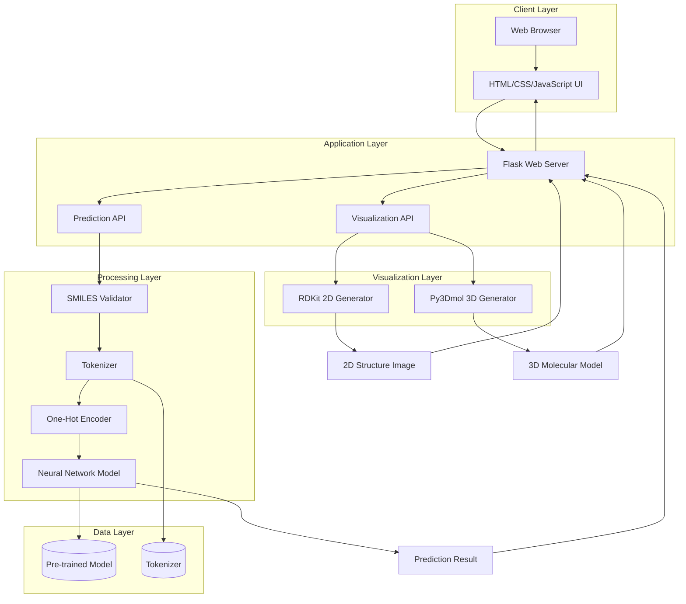
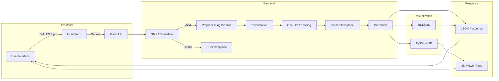
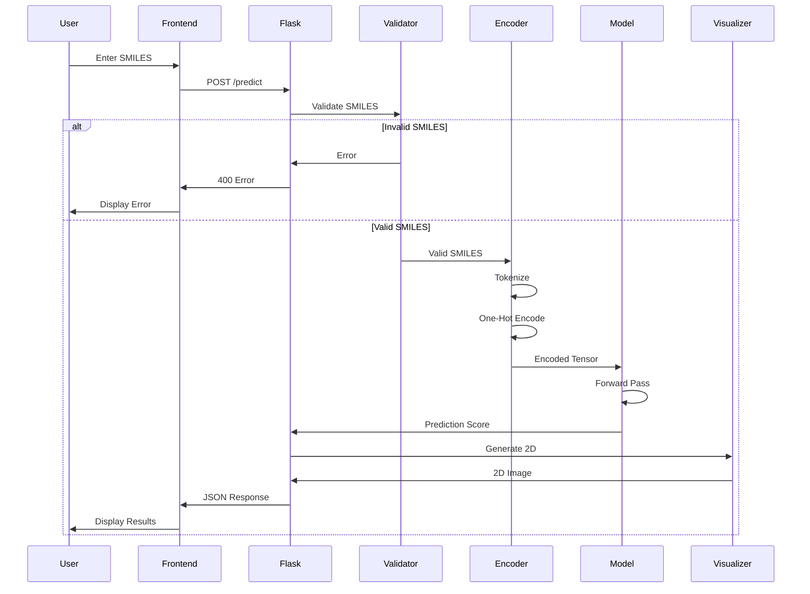

# System Architecture & Technical Documentation

## Project Metadata

**Project Name:** Drug-Likeness Predictor  
**Created:** April 4, 2025  
**Author:** Arjun V (Arjun Vavullipathy)  
**Register Number:** 221BCADA36  
**Academic Context:** BCA Data Analytics 30th Annual Project  
**Version:** 1.0  
**Last Updated:** January 2026

---

## Table of Contents
- [Project Metadata](#project-metadata)
- [System Overview](#system-overview)
- [Architecture Diagram](#architecture-diagram)
- [Component Details](#component-details)
- [Data Flow](#data-flow)
- [Model Architecture](#model-architecture)
- [Deployment Architecture](#deployment-architecture)
- [Technology Stack](#technology-stack)
- [Security Considerations](#security-considerations)

---

## System Overview

The Drug-Likeness Predictor is a full-stack web application that leverages deep learning to predict the drug-likeness of chemical compounds. The system follows a client-server architecture with a Flask backend serving both the web interface and RESTful API endpoints.

### High-Level Architecture



---

## Architecture Diagram

### System Components



---

## Component Details

### 1. Frontend Components

#### `index.html` - Main Interface
- **Purpose:** Primary user interface for SMILES input and prediction display
- **Features:**
  - SMILES input validation
  - Asynchronous prediction requests
  - Real-time result display
  - 2D structure visualization
  - Link to 3D viewer

#### `visualize.html` - 3D Viewer
- **Purpose:** Interactive 3D molecular structure visualization
- **Technology:** Py3Dmol.js
- **Features:**
  - Rotatable 3D models
  - Zoom and pan controls
  - Stick representation with element coloring

### 2. Backend Components

#### `app.py` - Flask Application
```python
# Core Components:
# 1. Model Loading
model = load_model("best_model.keras")
tokenizer = joblib.load("tokenizer.pkl")

# 2. SMILES Encoding
def one_hot_encode_smiles(smiles):
    # Converts SMILES to one-hot encoded tensor
    # Shape: (1, 71, 89)
    
# 3. 2D Visualization
def visualize_2D(smiles):
    # Generates 2D structure using RDKit
    # Returns: base64 encoded PNG
    
# 4. 3D Conversion
def convert_smiles_to_mol(smiles):
    # Generates 3D coordinates
    # Returns: MOL block format
```

**API Endpoints:**
- `GET /` - Serves main interface
- `POST /predict` - Prediction endpoint
- `GET /visualize_3d` - 3D visualization page

### 3. Model Components

#### Neural Network Architecture

```
Input Layer (71, 89)
    ↓
Conv1D (64 filters, kernel=3)
    ↓
MaxPooling1D (pool_size=2)
    ↓
Bidirectional LSTM (128 units)
    ↓
Dropout (0.3)
    ↓
LSTM (64 units)
    ↓
Dropout (0.3)
    ↓
Dense (32 units, ReLU)
    ↓
Dense (1 unit, Sigmoid)
    ↓
Output (Drug-likeness probability)
```

#### Model Files
- **best_model.keras** (1.2 MB)
  - Format: Keras SavedModel
  - Input shape: (batch_size, 71, 89)
  - Output shape: (batch_size, 1)
  
- **tokenizer.pkl** (711 bytes)
  - Format: Joblib pickle
  - Contains: Character to index mapping
  - Vocabulary size: 89 unique tokens

---

## Data Flow

### Prediction Pipeline



### Data Transformation Steps

1. **Input:** Raw SMILES string
   ```
   "CC(C)Cc1ccc(cc1)C(C)C(O)=O"
   ```

2. **Tokenization:** Break into characters
   ```python
   ['C', 'C', '(', 'C', ')', 'c', '1', 'c', 'c', 'c', ...]
   ```

3. **Padding:** Pad to max length (71)
   ```python
   ['C', 'C', '(', ..., '<PAD>', '<PAD>', ...]
   ```

4. **One-Hot Encoding:** Convert to tensor
   ```python
   Shape: (1, 71, 89)
   # 71 = max sequence length
   # 89 = vocabulary size
   ```

5. **Prediction:** Model inference
   ```python
   Output: 0.95 (95% drug-like)
   ```

6. **Classification:** Apply threshold
   ```python
   if score >= 0.5:
       label = "Drug-Like ✅"
   else:
       label = "Non-Drug-Like ⚠️"
   ```

---

## Model Architecture

### Layer-by-Layer Breakdown

#### Layer 1: Conv1D
- **Filters:** 64
- **Kernel Size:** 3
- **Activation:** ReLU
- **Purpose:** Extract local molecular features (functional groups, bonds)
- **Output Shape:** (batch, 35, 64)

#### Layer 2: MaxPooling1D
- **Pool Size:** 2
- **Purpose:** Reduce dimensionality, retain important features
- **Output Shape:** (batch, 17, 64)

#### Layer 3: Bidirectional LSTM
- **Units:** 128 (64 forward + 64 backward)
- **Return Sequences:** True
- **Purpose:** Capture long-range dependencies in both directions
- **Output Shape:** (batch, 17, 128)

#### Layer 4: Dropout
- **Rate:** 0.3
- **Purpose:** Prevent overfitting
- **Output Shape:** (batch, 17, 128)

#### Layer 5: LSTM
- **Units:** 64
- **Return Sequences:** False
- **Purpose:** Final sequence processing
- **Output Shape:** (batch, 64)

#### Layer 6: Dropout
- **Rate:** 0.3
- **Purpose:** Additional regularization
- **Output Shape:** (batch, 64)

#### Layer 7: Dense
- **Units:** 32
- **Activation:** ReLU
- **Purpose:** Feature combination
- **Output Shape:** (batch, 32)

#### Layer 8: Output Dense
- **Units:** 1
- **Activation:** Sigmoid
- **Purpose:** Binary classification
- **Output Shape:** (batch, 1)

### Training Configuration

```python
# Optimizer
optimizer = Adam(learning_rate=0.001)

# Loss Function
loss = 'binary_crossentropy'

# Metrics
metrics = ['accuracy']

# Callbacks
callbacks = [
    ModelCheckpoint('best_model.keras', save_best_only=True),
    EarlyStopping(patience=5, restore_best_weights=True),
    LearningRateScheduler(schedule)
]
```

### Model Performance

| Metric | Training | Validation |
|--------|----------|------------|
| Accuracy | ~85% | ~85% |
| ROC-AUC | ~0.89 | ~0.89 |
| Loss | 0.32 | 0.35 |
| Precision | ~0.84 | ~0.84 |
| Recall | ~0.86 | ~0.86 |

---

## Deployment Architecture

### Local Deployment

```
┌─────────────────────────────────────┐
│         User's Computer             │
│                                     │
│  ┌──────────────────────────────┐  │
│  │   Web Browser (Port 5000)    │  │
│  └────────────┬─────────────────┘  │
│               │                     │
│  ┌────────────▼─────────────────┐  │
│  │   Flask Development Server   │  │
│  │   - app.py                   │  │
│  │   - Port 5000                │  │
│  └────────────┬─────────────────┘  │
│               │                     │
│  ┌────────────▼─────────────────┐  │
│  │   TensorFlow Model           │  │
│  │   - best_model.keras         │  │
│  │   - tokenizer.pkl            │  │
│  └──────────────────────────────┘  │
└─────────────────────────────────────┘
```

### Production Deployment (Proposed)

```
┌──────────────────────────────────────────────┐
│              Cloud Platform                  │
│                                              │
│  ┌────────────────────────────────────────┐ │
│  │         Load Balancer                  │ │
│  └──────────────┬─────────────────────────┘ │
│                 │                            │
│     ┌───────────┼───────────┐               │
│     │           │           │               │
│  ┌──▼──┐     ┌──▼──┐     ┌──▼──┐           │
│  │App 1│     │App 2│     │App 3│           │
│  │(Gunicorn)│(Gunicorn)│(Gunicorn)│        │
│  └──┬──┘     └──┬──┘     └──┬──┘           │
│     │           │           │               │
│     └───────────┼───────────┘               │
│                 │                            │
│  ┌──────────────▼─────────────────────────┐ │
│  │         Model Storage (S3/GCS)         │ │
│  │   - best_model.keras                   │ │
│  │   - tokenizer.pkl                      │ │
│  └────────────────────────────────────────┘ │
│                                              │
│  ┌────────────────────────────────────────┐ │
│  │         Redis Cache                    │ │
│  │   (Frequent predictions)               │ │
│  └────────────────────────────────────────┘ │
└──────────────────────────────────────────────┘
```

---

## Technology Stack

### Backend Technologies

| Technology | Version | Purpose |
|------------|---------|---------|
| Python | 3.10+ | Core language |
| TensorFlow | 2.15.0 | Deep learning framework |
| Flask | 3.0.0 | Web framework |
| RDKit | 2022.9.5+ | Cheminformatics toolkit |
| NumPy | 1.24.0+ | Numerical computing |
| Pandas | 2.0.0+ | Data manipulation |
| Joblib | 1.3.2+ | Model serialization |
| Matplotlib | 3.7.0+ | Visualization |
| Pillow | 10.0.0+ | Image processing |

### Frontend Technologies

| Technology | Purpose |
|------------|---------|
| HTML5 | Structure |
| CSS3 | Styling |
| JavaScript (ES6+) | Interactivity |
| Py3Dmol.js | 3D visualization |
| Fetch API | Async requests |

### Development Tools

- **Jupyter Notebook** - Model development
- **Git** - Version control
- **Conda/venv** - Environment management

---

## Security Considerations

### Current Implementation

1. **Input Validation**
   - SMILES string validation using RDKit
   - Prevents injection attacks
   - Sanitizes user input

2. **Error Handling**
   - Graceful error messages
   - No sensitive information in errors
   - Proper HTTP status codes

3. **Resource Limits**
   - Max SMILES length: 71 characters
   - Single prediction per request
   - No file upload vulnerabilities

### Recommended Enhancements

1. **Authentication & Authorization**
   ```python
   # Implement JWT tokens
   # Rate limiting per user
   # API key management
   ```

2. **Rate Limiting**
   ```python
   from flask_limiter import Limiter
   limiter = Limiter(app, key_func=get_remote_address)
   
   @app.route('/predict')
   @limiter.limit("10 per minute")
   def predict():
       # ...
   ```

3. **HTTPS/SSL**
   - Enforce HTTPS in production
   - Use SSL certificates
   - Secure cookie flags

4. **CORS Configuration**
   ```python
   from flask_cors import CORS
   CORS(app, origins=['https://yourdomain.com'])
   ```

5. **Input Sanitization**
   - Additional validation layers
   - SQL injection prevention (if database added)
   - XSS protection

---

## Performance Optimization

### Current Optimizations

1. **Model Size:** Compact 1.2 MB model
2. **Inference Speed:** <100ms per prediction
3. **Memory Efficient:** One-hot encoding on-demand
4. **Static Assets:** Cached in browser

### Recommended Optimizations

1. **Caching Layer**
   ```python
   from functools import lru_cache
   
   @lru_cache(maxsize=1000)
   def predict_cached(smiles):
       # Cache frequent predictions
   ```

2. **Batch Processing**
   ```python
   def predict_batch(smiles_list):
       # Process multiple SMILES at once
       # Vectorized operations
   ```

3. **Model Optimization**
   - TensorFlow Lite conversion
   - Quantization (INT8)
   - Pruning unused weights

4. **CDN for Static Assets**
   - Serve JS/CSS from CDN
   - Reduce server load

---

## Monitoring & Logging

### Recommended Implementation

```python
import logging

# Configure logging
logging.basicConfig(
    level=logging.INFO,
    format='%(asctime)s - %(name)s - %(levelname)s - %(message)s',
    handlers=[
        logging.FileHandler('app.log'),
        logging.StreamHandler()
    ]
)

# Log predictions
logger.info(f"Prediction: {smiles} -> {score}")

# Log errors
logger.error(f"Invalid SMILES: {smiles}")
```

### Metrics to Track

- Prediction requests per minute
- Average response time
- Error rate
- Model accuracy on new data
- User engagement metrics

---

## Scalability Considerations

### Horizontal Scaling

```
Load Balancer
    ├── App Instance 1
    ├── App Instance 2
    └── App Instance 3
         ↓
    Shared Model Storage
```

### Vertical Scaling

- Increase server resources (CPU, RAM)
- GPU acceleration for batch predictions
- Optimize model inference

### Database Integration (Future)

```sql
-- Prediction History Table
CREATE TABLE predictions (
    id SERIAL PRIMARY KEY,
    smiles VARCHAR(255),
    prediction FLOAT,
    timestamp TIMESTAMP,
    user_id INTEGER
);

-- Create indexes
CREATE INDEX idx_smiles ON predictions(smiles);
CREATE INDEX idx_timestamp ON predictions(timestamp);
```

---

## Conclusion

This architecture provides a solid foundation for a drug-likeness prediction system. The modular design allows for easy maintenance and future enhancements. Key strengths include:

- ✅ Simple, maintainable codebase
- ✅ Fast inference times
- ✅ Extensible architecture
- ✅ Clear separation of concerns
- ✅ Production-ready with minor modifications

For production deployment, consider implementing the recommended security, caching, and monitoring enhancements.
